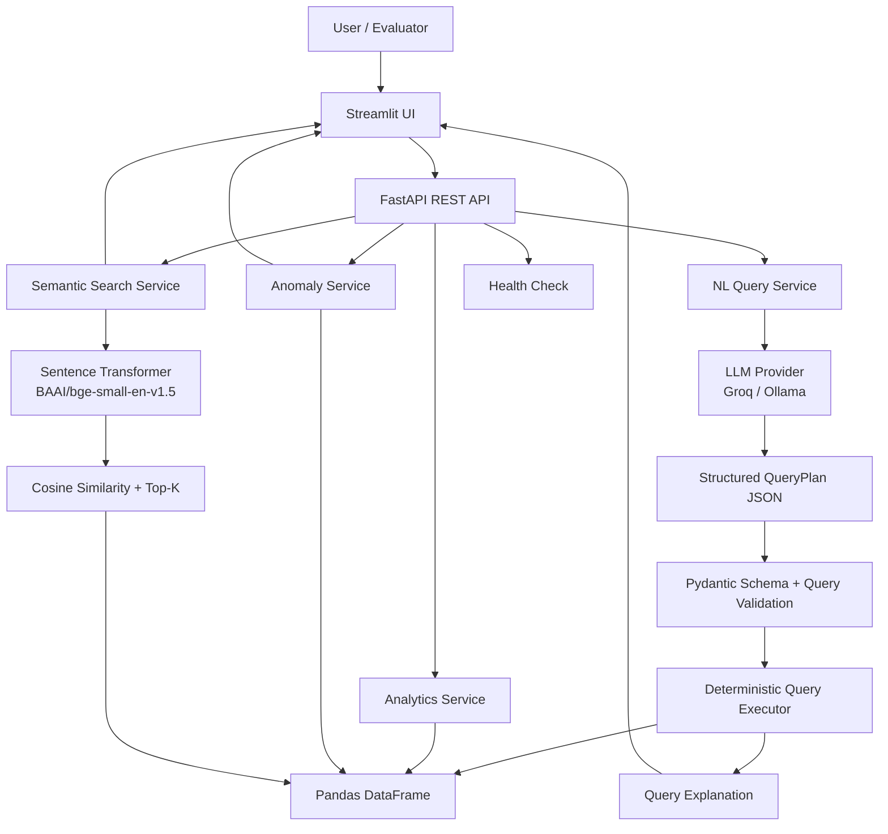

# AI Support Intelligence Platform

An end-to-end AI-powered support analytics system that turns a customer-support CSV into a queryable, explainable intelligence platform.

The system combines **natural-language querying, deterministic analytics, anomaly detection, and semantic ticket retrieval** behind a Python-based REST API and Streamlit UI. It is intentionally designed as a focused technical assessment prototype: the LLM handles language understanding, while validated deterministic code performs the actual data computation.

---

## Overview

Support teams often need answers to questions such as:

- How many tickets are currently open?
- Which agent resolved the most tickets in the latest reporting month?
- What is the average customer rating for Technical tickets?
- Which high-priority tickets are still unresolved and aging?
- Are there unusually long resolution times?
- Can similar support issues be found even when the wording is different?

This platform addresses those use cases through four core capabilities:

| Capability | Implementation |
|---|---|
| CSV ingestion | Pandas-based loading and normalization |
| Natural-language analytics | LLM → validated `QueryPlan` → deterministic Pandas execution |
| Anomaly detection | Explainable rule-based detection + IQR statistics |
| Semantic ticket retrieval | Local sentence-transformer embeddings + cosine similarity |

The application is exposed through **FastAPI REST endpoints** and a **Streamlit UI**, while remaining Python-only and runnable locally at zero service cost when using Ollama or an available free-tier LLM provider.

---

## Key Highlights

- **Natural-language querying** without allowing the LLM to generate or execute Python, Pandas, or SQL.
- **Structured QueryPlan** output validated with Pydantic before execution.
- **Deterministic analytics** for reproducible numerical results.
- Supports **AND/OR filtering**, status logic such as unresolved tickets, aggregations, grouping, sorting, and relative-date handling within the supported query plan.
- **Dataset-relative date handling** for questions such as "older than 24 hours", using the latest timestamp in the supplied dataset as the reference point rather than the machine's current date.
- **Explainable anomaly detection** using business rules and an IQR-based resolution-time outlier rule.
- **Semantic search** over `issue_summary`, allowing similarity-based retrieval rather than exact keyword matching.
- **LLM provider abstraction** with Groq and Ollama provider implementations.
- **FastAPI REST API** with health, query, analytics, anomaly, and semantic-search endpoints.
- **Streamlit UI** for practical evaluator walkthrough and exploration.
- **37 automated tests passing** in the latest project verification.
- No paid infrastructure, vector database, Docker requirement, or external database is required for the supplied 500-ticket dataset.

---

## Architecture

The core design principle is:

> **LLM interprets. Deterministic code computes.**

This separates language understanding from data computation and keeps numerical answers reproducible and controlled.



### Query execution flow

```text
Natural-language question
        ↓
LLM interprets intent
        ↓
Structured QueryPlan JSON
        ↓
Pydantic validation
        ↓
Semantic/query-plan validation
        ↓
Deterministic Pandas execution
        ↓
Calculated result
        ↓
Human-readable explanation + execution plan
```

The LLM is not trusted to calculate the final answer. It produces a constrained representation of the user's intent; deterministic application code performs the actual filtering, aggregation, grouping, sorting, and counting.

---

## Project Structure

```text
C:.
|   .env
|   .env.example
|   .gitignore
|   conftest.py
|   README.md
|   requirements.txt
|   run.py
|
+---app
|   |   config.py
|   |   main.py
|   |   __init__.py
|   |
|   +---analytics
|   |       aggregations.py
|   |       filters.py
|   |       service.py
|   |       trends.py
|   |       __init__.py
|   |
|   +---anomalies
|   |       detector.py
|   |       models.py
|   |       rules.py
|   |       __init__.py
|   |
|   +---api
|   |       routes_analytics.py
|   |       routes_anomalies.py
|   |       routes_health.py
|   |       routes_query.py
|   |       routes_search.py
|   |       __init__.py
|   |
|   +---data
|   |       loader.py
|   |       repository.py
|   |       __init__.py
|   |
|   +---llm
|   |       base.py
|   |       groq_provider.py
|   |       ollama_provider.py
|   |       prompts.py
|   |       __init__.py
|   |
|   +---query
|   |       executor.py
|   |       explainer.py
|   |       planner.py
|   |       schema.py
|   |       validator.py
|   |       __init__.py
|   |
|   \---retrieval
|           embedder.py
|           models.py
|           service.py
|           __init__.py
|
+---data
|       support_tickets.csv
|
+---tests
|       test_analytics.py
|       test_anomalies.py
|       test_data_loader.py
|       test_evaluation_queries.py
|       test_query_executor.py
|       test_retrieval.py
|
\---ui
        streamlit_app.py
```

### Main responsibilities

| Module | Responsibility |
|---|---|
| `app/data` | Load, normalize, cache, and provide access to support-ticket data |
| `app/analytics` | Filtering, aggregations, grouping, statistics, and trend-related operations |
| `app/llm` | Provider abstraction and LLM integrations |
| `app/query` | Query planning, schema validation, deterministic execution, and explanations |
| `app/anomalies` | Explainable anomaly rules, detection, and anomaly models |
| `app/retrieval` | Embedding generation, similarity search, and top-K ticket retrieval |
| `app/api` | FastAPI routes |
| `ui` | Streamlit evaluation and user interface |
| `tests` | Unit, regression, evaluation, and retrieval coverage |
| `run.py` | Single-command application startup |

---

## Dataset

The supplied dataset is:

`data/support_tickets.csv`

### Dataset statistics

| Metric | Value |
|---|---:|
| Rows | **500** |
| Columns | **10** |
| Unique agents | **12** |
| Tickets with customer ratings | **327** |
| Earliest `created_at` | **2024-01-01 08:54** |
| Latest `created_at` | **2024-03-30 18:06** |

### Status distribution

| Status | Tickets |
|---|---:|
| Resolved | **327** |
| Open | **111** |
| Escalated | **62** |

### Priority distribution

| Priority | Tickets |
|---|---:|
| Medium | **169** |
| Low | **142** |
| High | **134** |
| Critical | **55** |

### Category distribution

| Category | Tickets |
|---|---:|
| General | **189** |
| Billing | **159** |
| Technical | **152** |

### Dataset schema

| Column | Type | Description |
|---|---|---|
| `ticket_id` | String | Unique ticket identifier |
| `created_at` | Datetime | Ticket creation timestamp |
| `category` | String | Billing, Technical, or General |
| `priority` | String | Low, Medium, High, or Critical |
| `status` | String | Open, Resolved, or Escalated |
| `response_time_hrs` | Float | Hours from ticket creation to first agent response |
| `resolution_time_hrs` | Float | Hours from ticket creation to resolution; null for unresolved tickets |
| `agent_id` | String | Assigned support agent identifier |
| `customer_rating` | Integer | Post-resolution rating from 1 to 5; null for unresolved tickets |
| `issue_summary` | String | Short description of the reported issue |

Null values in unresolved-ticket fields are preserved rather than being converted to artificial zero values.

---

## Features

### 1. Natural-Language Querying

Users can ask business questions in normal language instead of writing Pandas or SQL.

Examples:

```text
How many tickets are currently open?

Which agent resolved the most tickets this month?

What is the average customer rating for Technical category tickets?

How many unresolved High or Critical tickets are older than 24 hours?
```

The LLM converts the question into a controlled `QueryPlan`. The plan is then validated and executed deterministically.

### 2. Structured QueryPlan

A simplified example:

```json
{
  "intent": "aggregate",
  "filters": [
    {
      "field": "status",
      "operator": "neq",
      "value": "Resolved"
    }
  ],
  "filter_groups": [
    {
      "logic": "OR",
      "conditions": [
        {
          "field": "priority",
          "operator": "eq",
          "value": "High"
        },
        {
          "field": "priority",
          "operator": "eq",
          "value": "Critical"
        }
      ]
    }
  ],
  "aggregation": "count"
}
```

This design prevents common failure modes such as:

- LLM-generated executable code
- inconsistent calculations
- invalid fields or operators
- accidental execution of arbitrary instructions

### 3. Explainable Query Results

The UI exposes more than a final number. For supported queries it can show:

- calculated result
- how the query was interpreted
- data scope
- query details
- structured execution plan
- human-readable calculation explanation

This makes the system easier to inspect during an architecture walkthrough.

### 4. Anomaly Detection

The anomaly engine uses deterministic and explainable rules.

#### Rule A — Stale high-priority tickets

A ticket is flagged when:

```text
status != Resolved
AND
priority ∈ {High, Critical}
AND
ticket age > 24 hours
```

For relative time questions, ticket age is calculated against the latest `created_at` timestamp in the supplied dataset.

#### Rule B — Resolution-time outliers

Resolution-time outliers are identified using the upper IQR boundary:

```text
IQR = Q3 - Q1
Upper Bound = Q3 + 1.5 × IQR
```

For the supplied dataset:

- Q1 = **6.15 hours**
- Q3 = **22.95 hours**
- Upper bound = **48.15 hours**
- Resolution-time values above this threshold are treated as statistical outliers.

#### Rule C — Low customer rating with slow resolution

Tickets are flagged when:

```text
customer_rating <= 2
AND
resolution_time_hrs > median resolution time
```

For the supplied dataset, the median resolution time is **12.0 hours**.

Each anomaly includes a ticket identifier, anomaly type, severity, reason, and relevant value where applicable.

### 5. Semantic Ticket Search

Semantic search retrieves support tickets by meaning rather than requiring exact keywords.

Example searches:

```text
payment problems

customers being charged incorrectly

login failures

API timeout issues
```

Implementation:

```text
issue_summary
     ↓
Sentence Transformer
BAAI/bge-small-en-v1.5
     ↓
384-dimensional embeddings
     ↓
Cosine similarity
     ↓
Top-K relevant tickets
```

The retrieval layer is kept separate from structured analytics so it can be replaced by a vector database later without changing the overall application design.

### 6. REST API

FastAPI provides the backend interface for health checks, analytics, NL queries, anomalies, and semantic search.

### 7. Streamlit UI

The Streamlit application provides a minimal, practical UI for:

- Overview
- AI Natural Language Query
- Anomalies
- Semantic Search

The UI is intentionally focused on demonstrating the system rather than adding unnecessary dashboard complexity.

---

## API Endpoints

| Method | Endpoint | Purpose |
|---|---|---|
| `GET` | `/health` | Service health check |
| `POST` | `/query` | Process a natural-language analytics query |
| `GET` | `/anomalies` | Detect and return anomalies |
| `GET` | `/analytics/summary` | Overall support-ticket summary |
| `GET` | `/analytics/agents` | Agent-level analytics |
| `GET` | `/analytics/categories` | Category-level analytics |
| `GET` | `/analytics/priorities` | Priority-level analytics |
| `GET` | `/search/semantic` | Semantic search over ticket summaries |

Interactive API documentation is available at:

```text
http://127.0.0.1:8000/docs
```

FastAPI also exposes the OpenAPI specification automatically.

---

## Technology Stack

### Backend

- **Python**
- **FastAPI**
- **Pydantic**
- **Uvicorn**
- **Pandas**
- **NumPy**

### LLM

- **Groq** provider
- **Ollama** provider for locally runnable models
- Default Groq model used by the project: **`llama-3.3-70b-versatile`**

### Retrieval

- **Sentence Transformers**
- **BAAI/bge-small-en-v1.5**
- **Cosine similarity**
- In-memory cached embeddings

### UI

- **Streamlit**

### Testing

- **Pytest**

No Node.js, React, external database, vector database, or paid API is required for the supplied assessment implementation.

---

## Why This Architecture?

The architecture is intentionally simple, modular, and easy to reason about.

### Why use an LLM?

Natural-language interpretation is the main AI requirement. The LLM is well suited to converting a business question into a structured representation of intent, filters, grouping, aggregation, and date constraints.

### Why not let the LLM generate Python or SQL?

Allowing an LLM to generate executable code increases security, validation, and reproducibility concerns.

Instead:

```text
LLM output
    ↓
Typed QueryPlan
    ↓
Validation
    ↓
Deterministic executor
```

This makes the computation predictable and keeps the boundary between AI interpretation and data execution explicit.

### Why Pandas?

The supplied dataset contains only **500 rows**, so Pandas provides:

- simple implementation
- transparent transformations
- fast local execution
- easy testing
- low infrastructure overhead

For a large production dataset, the same query-planning layer could target SQL or a warehouse-backed analytics service instead.

### Why no vector database?

The assessment dataset contains only **500 tickets**. For this scale, in-memory embeddings and NumPy similarity search are sufficient and keep the deployment simple.

For larger datasets, the retrieval service can be migrated to a vector store such as Qdrant, pgvector, or another managed/vector-backed solution.

### Why Streamlit?

The technical constraint is **Python only**, and the assessment asks for a minimal UI. Streamlit provides a practical Python-native interface without introducing a separate frontend stack.

### Why provider abstraction?

`app/llm/base.py` separates the application from a specific model provider. This allows the project to use a cloud free-tier provider such as Groq or a local Ollama model without rewriting the query pipeline.

---

## Setup

### Requirements

Recommended environment:

- Python **3.10+**
- pip
- Internet access for installing Python packages and, if not already cached, the embedding model
- Either:
  - a Groq API key, or
  - a locally running Ollama model

No paid service is required.

---

## Installation

### 1. Clone the repository

```bash
git clone <https://github.com/sarthak-engineer/ai-support-intelligence-platform.git>
cd ai-support-intelligence-platform
```

### 2. Create a virtual environment

#### Windows

```bash
python -m venv .venv
.venv\Scripts\activate
```

#### macOS / Linux

```bash
python3 -m venv .venv
source .venv/bin/activate
```

### 3. Install dependencies

```bash
pip install -r requirements.txt
```

### 4. Configure environment variables

Copy the example environment file:

```bash
copy .env.example .env
```

For macOS/Linux:

```bash
cp .env.example .env
```

When using Groq, set the API key in `.env` according to the variables documented in `.env.example`.

Do not commit real API keys or secrets to Git.

When using Ollama, ensure the Ollama service is running locally and that the configured local model is available.

---

## Start the System

The complete application starts with a **single command**:

```bash
python run.py
```

Expected local services:

### Streamlit UI

```text
http://localhost:8501
```

### FastAPI

```text
http://127.0.0.1:8000
```

### Swagger / OpenAPI

```text
http://127.0.0.1:8000/docs
```

The single startup script is intended to satisfy the assessment requirement that the evaluator can launch the system with one command.

---

## Example Queries

The following examples are based on the supplied 500-row dataset.

### Query 1

```text
How many tickets are currently open?
```

Expected result:

```text
111 tickets
```

### Query 2

```text
Which agent resolved the most tickets this month?
```

Using the **latest month represented in the dataset (March 2024)** as the reporting month:

```text
AGT-01 — 16 resolved tickets
```

### Query 3

```text
What is the average customer rating for Technical category tickets?
```

Expected result:

```text
3.74 / 5
```

### Query 4

```text
Show me all Critical tickets not resolved within 12 hours.
```

Expected behavior:

```text
Returns the matching Critical tickets as a ticket-level result set,
rather than fabricating a summary that is not supported by the data.
```

### Query 5

```text
Are there any anomalies in resolution times this week?
```

Expected behavior:

```text
Returns anomaly records identified by the deterministic anomaly engine,
including the anomaly type, severity, reason, and relevant value.
```

### Query 6

```text
How many unresolved High or Critical tickets are older than 24 hours?
```

Expected behavior:

```text
The planner represents:
- unresolved status logic
- High OR Critical priority logic
- a dataset-relative 24-hour age condition

The final result is then calculated deterministically by the query executor.
```

---

## Handling Ambiguous or Unsupported Questions

The system is intentionally conservative.

For supported questions, the planner creates a valid QueryPlan and the executor produces the result.

For unsupported or out-of-domain questions, the application should return a clear fallback instead of inventing an answer.

Example:

```text
What is the weather in Bengaluru?
```

Expected behavior:

```text
The system should explain that the requested information is outside
the available support-ticket dataset/domain.
```

This behavior is preferred over hallucinating a data result.

---

## Relative Date Handling

Relative date questions require special care because the supplied dataset is historical.

The latest ticket timestamp is:

```text
2024-03-30 18:06
```

Therefore, relative conditions such as:

```text
older than 24 hours
this week
this month
```

are interpreted against the **dataset's available time range/reference timestamp**, where supported, rather than against the evaluator's real-world date in 2026.

This keeps queries grounded in the data actually available to the system.

---

## Anomaly Detection Design

The anomaly engine is intentionally explainable rather than relying on an opaque model.

```text
Support Tickets
      ↓
Deterministic Rules
      ├── Stale High/Critical + Unresolved > 24h
      ├── Resolution-time IQR outliers
      └── Low rating + slow resolution
      ↓
Anomaly Model
      ↓
Ticket ID + Type + Severity + Reason + Value
```

This makes every anomaly traceable to a specific rule.

---

## Testing

The project includes automated tests covering:

- data loading and normalization
- analytics behavior
- anomaly detection
- deterministic query execution
- assessment/evaluation queries
- semantic retrieval

Run the full test suite with:

```bash
python -m pytest -q
```

Latest verification:

```text
37 passed
```

The evaluation-query tests include important edge cases such as:

- unresolved status handling
- `High OR Critical` priority logic
- relative time conditions
- deterministic result execution
- unsupported/out-of-domain query handling

---

## Error Handling and Validation

Several validation layers are used:

```text
User Question
     ↓
LLM Provider
     ↓
JSON QueryPlan
     ↓
Pydantic Validation
     ↓
Allowed Fields / Operators / Aggregations
     ↓
Deterministic Execution
     ↓
Result or Controlled Fallback
```

The query validator prevents unsupported fields and operations from reaching the executor.

The application also avoids exposing arbitrary generated code from the LLM.

---

## Data and Security Considerations

- Real API credentials belong in `.env`.
- `.env` is excluded through `.gitignore`.
- `.env.example` contains safe placeholder values only.
- The LLM is not permitted to generate executable Python/Pandas/SQL for the query pipeline.
- Retrieved semantic-search results expose ticket metadata and similarity scores, not raw embedding vectors.
- The current assessment prototype is designed for local evaluation and does not attempt to implement a full production identity, authorization, rate-limiting, or audit platform.

---

## Performance and Caching

For the provided dataset size, the project favors low infrastructure overhead.

The implementation uses caching where appropriate for:

- loaded ticket data
- embedding model initialization
- generated ticket embeddings

This avoids repeating expensive setup work during repeated queries or searches.

---

## Known Limitations

The project is intentionally scoped to a focused assessment prototype.

1. **Bounded QueryPlan**
   - The natural-language query engine supports a controlled set of intents, filters, aggregations, grouping, sorting, and date operations.
   - Highly complex multi-stage analytical questions may return a controlled unsupported-query response.

2. **In-memory analytics**
   - Pandas is appropriate for the supplied 500-row dataset.
   - Large-scale deployments should move analytical workloads to a database, SQL engine, or warehouse.

3. **In-memory semantic retrieval**
   - Embeddings are stored and searched locally.
   - At larger scale, a vector database or vector-enabled database would be more appropriate.

4. **Provider dependency for LLM queries**
   - Natural-language planning requires an available Groq or Ollama provider.
   - Deterministic analytics and anomaly logic remain application-side computations.

These are deliberate scope decisions rather than hidden behavior.

---

## Scaling the System

A production-scale version could evolve without replacing the core architecture.

```text
Current Assessment
------------------
CSV
 ↓
Pandas
 ↓
In-memory embeddings


Production Evolution
--------------------
Data Warehouse / PostgreSQL
        ↓
Analytics Service
        ↓
Validated QueryPlan

Object Storage
        ↓
Embedding Pipeline
        ↓
Vector Database

LLM Gateway
        ↓
Provider Routing / Retry / Observability

API Gateway
        ↓
FastAPI Services
        ↓
Web Application
```

Possible next-stage improvements include:

- PostgreSQL or warehouse-backed analytics
- Qdrant/pgvector for large-scale semantic retrieval
- asynchronous embedding generation
- background ingestion jobs
- pagination and filtering at the API layer
- authentication and role-based access
- rate limiting
- structured observability and tracing
- LLM response monitoring and evaluation
- query/result caching
- model routing and fallback providers
- larger-scale data ingestion pipelines

The current modular separation is intended to make these changes incremental rather than requiring a full rewrite.

---

## Assessment Alignment

The implementation directly maps to the assessment requirements:

| Assessment Requirement | Implementation |
|---|---|
| Ingest CSV and make it queryable | Pandas loader + repository |
| Natural-language questions | LLM planner + structured QueryPlan |
| LLM required for NL understanding | Groq / Ollama provider layer |
| Detect anomalies | Rule-based + IQR anomaly detector |
| REST API | FastAPI |
| Minimal UI | Streamlit |
| Python only | Yes |
| Zero-cost execution | Groq free tier or local Ollama |
| Single-command startup | `python run.py` |
| README documentation | This document |
| Test coverage | 37 passing tests in latest verification |

---

## Design Trade-offs

### Accuracy vs. flexibility

Instead of asking the LLM to directly compute results, the system restricts the model to query interpretation. This reduces flexibility for very complex questions but improves predictability and reproducibility.

### Simplicity vs. scale

The assessment dataset contains only 500 rows, so Pandas and in-memory retrieval keep the solution easy to run and inspect. Production-scale infrastructure would be introduced only when the workload justifies it.

### Infrastructure vs. delivery

The project deliberately avoids unnecessary services such as a vector database, separate frontend stack, Docker cluster, or external database for the assessment dataset. This keeps the system portable and aligned with the Python-only constraint.

---

## Development Principles

The project follows several core engineering principles:

- **Deterministic computation**
- **Explicit validation**
- **Modular service boundaries**
- **Provider abstraction**
- **Explainability**
- **Controlled scope**
- **Fail-safe behavior for unsupported queries**
- **Tests for evaluation-critical edge cases**

The goal is not simply to produce a working demo, but to make the reasoning and boundaries of the AI system easy to inspect.

---

## Quick Start

For an evaluator who already has Python configured:

```bash
pip install -r requirements.txt
python run.py
```

Then open:

```text
http://localhost:8501
```

API documentation:

```text
http://127.0.0.1:8000/docs
```

Run tests:

```bash
python -m pytest -q
```

---

## Final Verification Checklist

Before submission, verify:

```text
[ ] requirements.txt installs successfully
[ ] .env contains only local secrets and is gitignored
[ ] .env.example contains placeholders only
[ ] python run.py starts the complete system
[ ] Streamlit UI opens on port 8501
[ ] FastAPI opens on port 8000
[ ] /docs is accessible
[ ] Natural-language queries return QueryPlan + deterministic results
[ ] Unresolved logic works correctly
[ ] AND/OR filters work correctly
[ ] Relative-date queries use the dataset time reference
[ ] Anomaly detection returns explainable results
[ ] Semantic search returns relevant tickets
[ ] Unsupported questions fail gracefully
[ ] python -m pytest -q passes
```

---

## Conclusion

The **AI Support Intelligence Platform** demonstrates an end-to-end approach to building an AI-assisted support analytics system with a clear separation between **LLM-based language understanding** and **deterministic data computation**.

It combines practical AI engineering techniques—structured LLM outputs, validation, explainable anomaly detection, local semantic retrieval, API design, testing, and a lightweight UI—while keeping the implementation aligned with the assessment's Python-only and zero-cost requirements.

The architecture is intentionally focused: the four required capabilities are implemented first, with semantic retrieval added as a targeted AI differentiator rather than introducing unnecessary infrastructure or unfinished features.
