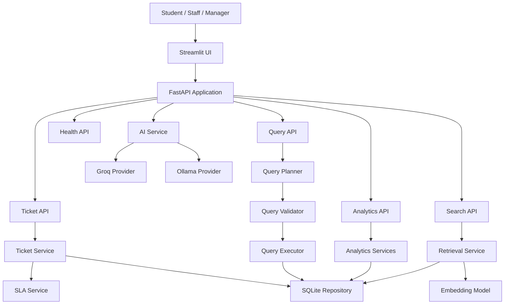

# EduSupport AI
### AI-Powered Student Support & Resolution Platform

EduSupport AI is a full-stack, AI-assisted student support and ticket management platform designed for a college environment.

It provides a structured workflow for students to raise support requests, staff to triage and resolve them, and managers to monitor operational performance through SLA tracking, escalation, analytics, semantic search, and natural-language insights.

The project is designed as an assessment-ready product engineering prototype with a clear separation between AI-assisted interpretation and deterministic business logic.

---

## 1. Problem Statement

Student support requests are often handled through disconnected channels, making it difficult to:

- track requests from creation to resolution
- assign ownership to the right staff member
- prioritize urgent issues
- monitor SLA commitments and ageing
- identify tickets that need escalation
- maintain a reliable activity history
- reuse solutions from previously resolved issues
- provide management with operational visibility
- extract insights from support data without manually querying datasets

EduSupport AI addresses these needs through a centralized support workflow with controlled AI assistance.

---

## 2. Product Overview

The platform supports three operational roles:

| Role | Primary Responsibilities |
|---|---|
| Student | Create tickets, view own tickets, reply, and track status/SLA |
| Staff | Manage assigned/unassigned tickets, assign/reassign, reply, add internal notes, use AI assistance, resolve and escalate |
| Manager | Monitor support operations, review all tickets, oversee SLA/escalation, and use analytics |

### High-Level Workflow

```text
Student
   |
   v
Create Support Ticket
   |
   v
AI-assisted Classification
   |
   v
Priority + Category + SLA
   |
   v
Assignment / Ownership
   |
   v
Staff Processing
   |
   +--------------------+
   |                    |
   v                    v
Pending              Escalation
   |                    |
   +----------+---------+
              |
              v
          Resolution
              |
              v
        Closure / Tracking
              |
              v
      Manager Visibility
```

---

## 3. Key Features

### Student Support
- Create a support ticket
- View own tickets
- View ticket details
- Reply to support staff
- Track status and SLA
- Secure ticket ownership checks

### Staff Operations
- View assigned queue
- View unassigned tickets
- Assign and reassign tickets
- Change priority and status
- Add replies
- Add internal notes
- Put tickets into pending state with a reason
- Escalate tickets with an escalation reason
- Resolve tickets with resolution notes
- Use AI-assisted classification
- Generate AI response drafts
- Search for similar historical tickets

### Manager Operations
- Support operations dashboard
- Total/open/unassigned/resolved visibility
- SLA at-risk and SLA-breached visibility
- Escalation visibility
- Category and priority analytics
- All-ticket search and filtering
- Staff workload visibility
- Natural-language operational analytics

---

## 4. Ticket Lifecycle

```text
NEW
 |
 v
ASSIGNED
 |
 v
IN_PROGRESS
 |
 +----------------------+
 |                      |
 v                      v
PENDING              ESCALATED
 |                      |
 |                      |
 +----------+-----------+
            |
            v
        IN_PROGRESS
            |
            v
        RESOLVED
            |
            v
          CLOSED
```

### Pending Workflow

A ticket may be placed in `PENDING` when work cannot continue immediately.

The application records a pending reason such as:

- Waiting for Student
- Waiting for Documents
- Waiting for Department
- Waiting for External System

The reason is added to the ticket activity history.

### Resolution Tracking

When a ticket is resolved, the system records:

- resolution timestamp
- resolving staff member
- resolution notes
- historical SLA outcome

---

## 5. SLA Management

SLA is handled using deterministic application logic rather than an LLM.

### Default SLA Targets

| Priority | SLA Target |
|---|---:|
| Critical | 4 hours |
| High | 8 hours |
| Medium | 24 hours |
| Low | 48 hours |

### Active Ticket States

```text
SLA consumption
      |
      +---- < 80% ---------> NORMAL
      |
      +---- 80% to <100% --> AT_RISK
      |
      +---- >= 100% -------> BREACHED
```

For active tickets, the UI can show remaining or overdue time.

For resolved or closed tickets, the SLA timer stops and the application shows the historical result:

- `SLA MET`
- `SLA BREACHED`

This prevents resolved tickets from becoming newly breached after they have already been completed.

---

## 6. Activity History

Important ticket actions are recorded as an immutable activity timeline.

Typical events include:

- Ticket created
- Assigned
- Reassigned
- Status changed
- Priority changed
- Reply added
- Internal note added
- Pending reason recorded
- Escalated
- Resolved
- Closed
- Reopened, where applicable

Activity is scoped by `ticket_id`, ensuring that one ticket's history is not mixed with another ticket's events.

---

## 7. AI Architecture

EduSupport AI intentionally keeps AI responsibilities controlled and auditable.

### AI Capability Map

| Capability | Purpose |
|---|---|
| Ticket Classification | Suggest category, priority, and intent |
| AI Response Assistant | Generate a draft response for staff review |
| Similar Ticket Search | Retrieve semantically similar historical tickets |
| Natural Language Analytics | Convert business questions into validated structured query plans |

---

## 8. Natural Language Analytics Architecture

The platform does not let the LLM directly execute arbitrary Python or SQL.

```text
User Question
      |
      v
LLM Interpretation
      |
      v
Structured QueryPlan
      |
      v
Schema / Query Validation
      |
      v
Deterministic Executor
      |
      v
Pandas / Application Logic
      |
      v
Readable Result
      |
      +----> Optional Execution Plan Details
```

### Example Questions

```text
How many total tickets are there?

How many unresolved high priority fee tickets are there?

Which category has the most tickets?

Which staff member has the highest open-ticket workload?

What is the average resolution time by category?

How many escalated tickets are there?

Show unresolved fee tickets older than 24 hours.

How many active SLA-breached tickets are there?
```

The UI presents a readable answer first and keeps technical execution-plan details secondary.

### Unsupported Queries

Questions outside the support-data domain are rejected with a clear scope response rather than fabricated information.

Example:

```text
What is the weather in Bengaluru?
```

Expected behavior:

```text
Unsupported query / outside the application's analytics scope.
```

---

## 9. Similar Ticket Search

Semantic retrieval uses embeddings to identify historical tickets that are similar in meaning, not only by exact keyword overlap.

### Example Query

```text
I paid my semester fee but the payment is still showing as pending.
```

The system searches historical support tickets and surfaces relevant similar cases.

Where no sufficiently relevant result is found, the application returns:

```text
No similar resolved tickets found.
```

This feature is intended to help staff reuse previously resolved solutions.

---

## 10. AI Response Assistant

Staff can generate a response draft from the context of the current ticket.

```text
Ticket Context
      |
      v
LLM
      |
      v
Suggested Response
      |
      v
Staff Review / Edit
      |
      v
Manual Send
```

The generated response is a draft only. Staff remain responsible for reviewing and sending the final message.

---

## 11. Role and Access Model

EduSupport AI currently uses a role-selection mechanism in the Streamlit interface to simulate the active user for the assessment environment.

### Student

Students can:

- create tickets
- view only their own tickets
- reply to their own tickets
- track their ticket status and SLA

Students cannot access another student's ticket or staff-only management actions.

### Staff

Staff can:

- view their assigned queue
- claim/assign tickets where permitted
- reassign tickets where permitted
- update status and priority
- reply to students
- add internal notes
- use AI assistance
- resolve tickets
- escalate tickets

### Manager

Managers can:

- view overall support operations
- inspect all tickets
- monitor assignment and escalation
- review SLA/ageing metrics
- use natural-language analytics

---

## 12. Security and Authorization Boundary

Backend authorization checks are used to enforce student ticket ownership and role-specific actions.

For example:

```text
Student STU1234
      |
      +-----> Own Ticket ------> ALLOWED
      |
      +-----> Another Student --> DENIED
```

The current assessment build does not implement a production authentication provider such as OAuth or JWT. The active identity is simulated through the Streamlit role/user controls.

This limitation is documented rather than hidden.

---

## 13. System Architecture



### Architectural Principle

The application separates:

- UI concerns
- API/controller concerns
- business services
- deterministic SLA/workflow logic
- analytics
- query planning/validation/execution
- LLM integration
- semantic retrieval
- persistence

This keeps AI behavior isolated from core business rules.

---

## 14. Data Flow

```text
                   +----------------------+
                   |   Streamlit UI       |
                   +----------+-----------+
                              |
                              v
                   +----------------------+
                   |   FastAPI API Layer  |
                   +----------+-----------+
                              |
              +---------------+----------------+
              |               |                |
              v               v                v
        Ticket Service   Analytics        AI / Query
              |               |                |
              v               v                v
        SLA Service      Aggregations      LLM / Retrieval
              |                              |
              +---------------+--------------+
                              |
                              v
                   +----------------------+
                   |   SQLite Database    |
                   +----------------------+
```

---

## 15. Core Data Model

The current application centers on ticket-oriented support records.

A simplified logical model is:

```text
Student
   |
   +----< Ticket >---- Staff
            |
            +----< Activity
            |
            +----< Messages / Replies
```

### Ticket

Representative ticket attributes include:

- ticket ID
- student ID
- student name
- subject
- description / issue summary
- category
- priority
- status
- assigned staff
- created timestamp
- updated timestamp
- SLA state
- SLA deadline / timing information
- resolution information
- escalation information
- pending information where applicable

### Activity

Representative activity attributes include:

- ticket ID
- actor
- actor role
- action/event
- timestamp
- contextual reason/details

The exact implementation remains in the application models/services and should be treated as the source of truth.

---

## 16. Technology Stack

### Backend
- Python
- FastAPI
- Pydantic-based validation
- SQLite

### Frontend
- Streamlit

### AI / LLM
- Groq
- Ollama
- Controlled prompt-based structured interpretation
- Sentence Transformers for semantic retrieval

### Data / Analytics
- Pandas
- Deterministic query execution
- Aggregation and filtering services

### Testing
- Pytest

### Development
- Git
- GitHub
- Python virtual environment

---

## 17. Repository Structure

```text
C:\Users\sarth\Desktop\ai-support-intelligence-platform\
│
├── .env
├── .gitignore
├── README.md
├── AI_USAGE_REPORT.md
├── requirements.txt
├── run.py
│
├── app/
│   ├── config.py
│   ├── main.py
│   │
│   ├── analytics/
│   │   ├── aggregations.py
│   │   ├── filters.py
│   │   ├── service.py
│   │   └── trends.py
│   │
│   ├── api/
│   │   ├── routes_analytics.py
│   │   ├── routes_health.py
│   │   ├── routes_query.py
│   │   ├── routes_search.py
│   │   └── routes_tickets.py
│   │
│   ├── data/
│   │   ├── db.py
│   │   ├── loader.py
│   │   └── repository.py
│   │
│   ├── llm/
│   │   ├── base.py
│   │   ├── groq_provider.py
│   │   ├── ollama_provider.py
│   │   └── prompts.py
│   │
│   ├── query/
│   │   ├── executor.py
│   │   ├── explainer.py
│   │   ├── planner.py
│   │   ├── schema.py
│   │   └── validator.py
│   │
│   ├── retrieval/
│   │   ├── embedder.py
│   │   ├── models.py
│   │   └── service.py
│   │
│   └── services/
│       ├── ai_service.py
│       ├── sla_service.py
│       └── ticket_service.py
│
├── data/
│   ├── edusupport.db
│   └── support_tickets.csv
│
├── screenshots/
│
├── scripts/
│   └── seed_db.py
│
├── tests/
│   ├── test_analytics.py
│   ├── test_data_loader.py
│   ├── test_evaluation_queries.py
│   ├── test_query_executor.py
│   ├── test_retrieval.py
│   └── test_ticket_workflow.py
│
└── ui/
    └── streamlit_app.py
```

---

## 18. Local Setup

### 1. Clone the repository

```bash
git clone <https://github.com/sarthak-engineer/edusupport-ai.git>
cd edusupport-ai
```

### 2. Create and activate a virtual environment

Windows:

```bash
python -m venv .venv
.venv\Scripts\activate
```

### 3. Install dependencies

```bash
pip install -r requirements.txt
```

### 4. Configure environment variables

Create a local `.env` file based on the variables required by the project.

Example:

```env
GROQ_API_KEY=your_groq_api_key
```

Never commit real API keys or other secrets.

### 5. Reset to the clean demo state

```bash
python scripts/seed_db.py
```

The seed script restores the database to the clean college-support demo dataset used by the project.

### 6. Start the application

```bash
python run.py
```

The application starts the FastAPI backend and Streamlit UI.

Default local endpoints used by the project:

```text
Backend:  http://localhost:8000
Frontend: http://localhost:8501
```

FastAPI API documentation is available through the standard OpenAPI interface when the backend is running:

```text
http://localhost:8000/docs
```

---

## 19. Testing

The final project test suite covers the core application behavior.

Run:

```bash
.venv\Scripts\pytest tests\
```

The final verification reported:

```text
37 passed
2 warnings
```

The warnings are non-critical deprecation warnings reported by the underlying HTTP test stack.

The test suite covers areas including:

- analytics
- data loading
- query evaluation
- deterministic query execution
- semantic retrieval
- ticket workflow
- authorization/student isolation

---

## 20. Validation and Edge Cases

The application explicitly handles edge cases such as:

- empty or too-short ticket subjects
- empty or too-short descriptions
- unauthorized access to another student's ticket
- missing assignment
- status changes
- pending reasons
- resolution notes
- escalation reasons
- SLA at-risk state
- SLA breach state
- historical SLA outcome after resolution
- unsupported natural-language analytics queries
- AI/API failures
- no similar-ticket matches

The goal is graceful handling rather than silently producing incorrect data.

---

## 21. Demo Scenarios

### Scenario A — Student

1. Select `Student`
2. Confirm the active student identity
3. Open `Create Ticket`
4. Create:

```text
Subject:
Semester fee payment still pending

Description:
I completed the semester fee payment, but my student portal still shows the payment as pending.
```

5. Confirm the ticket appears in `My Tickets`
6. Open the ticket
7. Verify student ownership, status and SLA

### Scenario B — Staff

1. Switch to `Staff`
2. Find the ticket
3. Assign/claim it
4. Run AI-assisted classification where available
5. Generate an AI response draft
6. Review/edit the response
7. Add an internal note if required
8. Update status
9. Escalate, put pending, or resolve depending on the scenario

### Scenario C — Manager

1. Switch to `Manager`
2. Open the dashboard
3. Review ticket/SLA/escalation metrics
4. Open `All Tickets`
5. Filter by ticket/student/category/status
6. Open a ticket
7. Run Natural Language Analytics

---

## 22. Example NL Analytics Questions

These queries are useful for demonstrating different parts of the query engine:

```text
How many total tickets are there?

How many unresolved high priority fee tickets are there?

Which category has the most tickets?

Which staff member has the highest open-ticket workload?

What is the average resolution time by category?

How many escalated tickets are there?

Show unresolved fee tickets older than 24 hours.

How many active SLA-breached tickets are there?
```

---

## 23. Screenshots

Final documentation screenshots are stored in:

```text
screenshots/
```

Recommended evidence:

- Manager dashboard
- All Tickets with filters
- Student ticket creation
- Student My Tickets
- Student Ticket Detail
- Staff Ticket Management
- Similar Ticket Search with results
- Natural Language Analytics with a successful result

These screenshots are intended to demonstrate the product workflow rather than document development/debugging states.

---

## 24. Engineering Decisions

### Deterministic business logic for critical operations

SLA calculations, ticket state handling, ownership checks, and operational metrics are handled by application logic rather than relying on LLM decisions.

### Controlled LLM usage

The LLM is used for interpretation and assistance, not as an unrestricted execution engine.

### Validated Query Plans

Natural-language analytics are converted into a constrained, validated structure before deterministic execution.

### Human-in-the-loop AI

AI classification and response generation are suggestions. Staff can review and override them.

### Semantic retrieval

Similar-ticket search uses embeddings to improve discovery of previously resolved cases.

### Scope discipline

The assessment version intentionally prioritizes the Student Support & Ticket Management problem instead of expanding into unrelated infrastructure.

---

## 25. Trade-offs

### Streamlit instead of a separate frontend framework

Streamlit keeps the prototype fast to run and reduces deployment/maintenance complexity for an assessment-focused build.

### SQLite for the assessment prototype

SQLite provides a simple, portable local persistence layer and is sufficient for the demo environment.

A production deployment would typically move to a managed relational database with stronger multi-user operational requirements.

### Simulated authentication

The current version uses role/user selection in the Streamlit UI rather than a full authentication provider.

A production implementation should use proper authentication and identity management such as OAuth/JWT.

### Read-time SLA evaluation

SLA state is calculated dynamically when ticket information is retrieved.

A production system could add scheduled background processing for proactive notifications and escalation events.

---

## 26. Known Limitations

This assessment build intentionally has a limited scope.

1. **Authentication**
   - Active user identity is simulated through the Streamlit role/user controls.
   - A production deployment should add OAuth/JWT or an equivalent identity system.

2. **Background notifications**
   - There is no background cron/job system that sends a notification exactly when an SLA crosses from `AT_RISK` to `BREACHED`.
   - SLA state is evaluated dynamically at read time.

3. **Local persistence**
   - SQLite is used for the assessment/demo environment.
   - A production system would normally use a managed multi-user database.

These limitations are deliberate scope trade-offs and do not remove the core assessment workflow.

---

## 27. AI Usage Transparency

AI-assisted development was used during implementation.

The project includes:

```text
AI_USAGE_REPORT.md
```

That document records how AI tools were used, what they contributed, what was reviewed/modified, and how the resulting implementation was validated.

The application itself also keeps AI behavior constrained through:

- structured outputs
- validation
- deterministic business rules
- human review for generated responses
- explicit fallback behavior

---

## 28. Project Quality Principles

EduSupport AI follows these principles:

```text
Correctness before complexity
Deterministic rules before LLM decisions
Validation before execution
Human review before external communication
Clear ownership for every ticket
Observable ticket history
Graceful failure instead of fabricated results
Focused scope instead of unnecessary infrastructure
```

---

## 29. What This Project Demonstrates

EduSupport AI demonstrates practical product-engineering capabilities across:

- Python backend development
- FastAPI API design
- Streamlit product UI
- data modeling and persistence
- service-oriented business logic
- SLA and workflow engines
- role-based access behavior
- analytics and deterministic computation
- natural-language interfaces
- structured LLM integration
- semantic search
- human-in-the-loop AI
- validation and edge-case handling
- automated testing
- documentation and engineering trade-offs

---

## 30. Assessment Scope

This project was developed as a focused solution for a Student Support & Ticket Management problem.

The implementation prioritizes:

```text
Ticket Lifecycle
      +
Assignment / Ownership
      +
SLA / Ageing
      +
Resolution / Activity History
      +
Escalation / Pending
      +
Management Visibility
      +
AI Assistance
```

The system is intentionally kept focused on those outcomes rather than adding infrastructure that does not materially improve the assessment use case.

---

## 31. Dataset

The project includes a 500-ticket support dataset used as deterministic demo/seed data.

The dataset was reused from an earlier assessment and adapted to the college student-support domain. It is used for ticket workflows, analytics, SLA evaluation, and semantic retrieval.

---

## License

This project is an assessment/prototype project. Add the repository-specific license here if a formal open-source license is desired.
